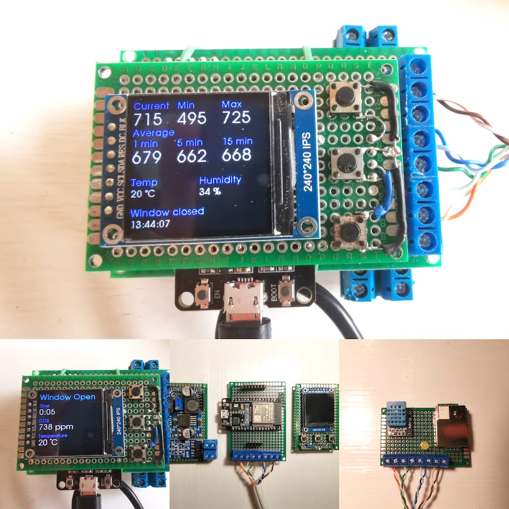

# Window Control

Control automatic windows based on sensor data or time.

Hardware hooks in parallel to existing buttons used to control windows.

# Hardware

ESP32.

240x240px IPS screen.

MH-Z19B CO2 reader.

DHT temperature and humidity sensor.

DC-DC buck converters for reading 24v signal from existing system.

MOSFET for allowing 24v signal to pass trough, emulating button press.

# Software

Written in Arduino IDE 2.0.

Coded in C.

**Extra Fonts**

http://oleddisplay.squix.ch/

**Modifying font**

https://tchapi.github.io/Adafruit-GFX-Font-Customiser/

# Libraries

These libraries needs to be installed in Arduino IDE to be able to build.

**EspSoftwareSerial** by Dirk Kaar, Peter Lerup

https://github.com/plerup/espsoftwareserial/

**MH-Z19** by Jonathan Dempsey

https://github.com/WifWaf/MH-Z19/blob/master/examples/RetrieveDeviceInfo/RetrieveDeviceInfo.ino

**GFX Library for Arduino** by Moon On Our Nation

https://github.com/moononournation/Arduino_GFX/blob/master/examples/HelloWorld/HelloWorld.ino

**FTDebouncer** by Ubi de Feo

https://github.com/ubidefeo/FTDebouncer

**DHT sensor library** by Adafruit

https://github.com/adafruit/DHT-sensor-library
