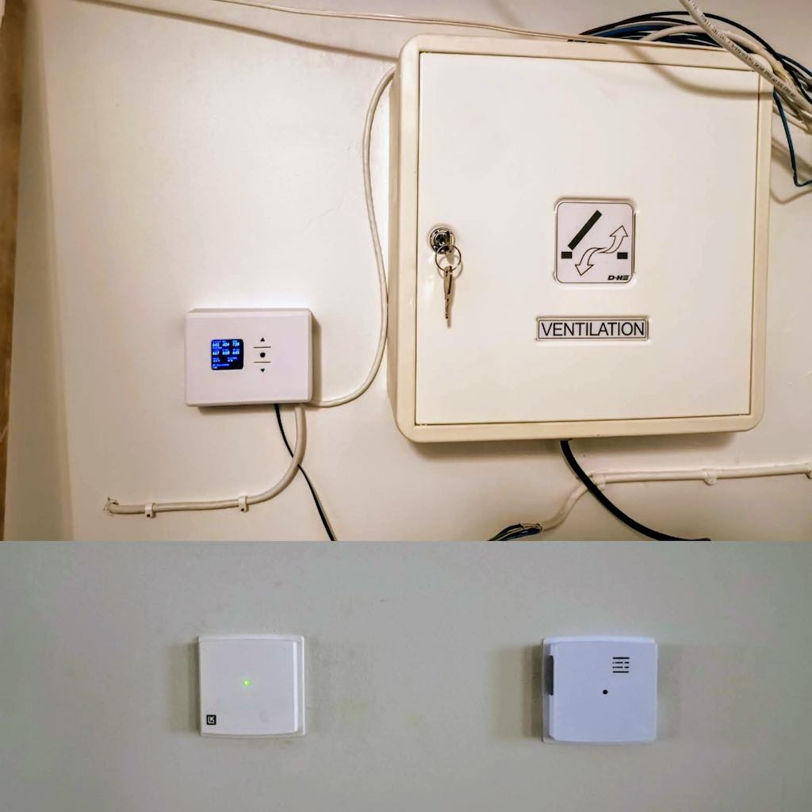
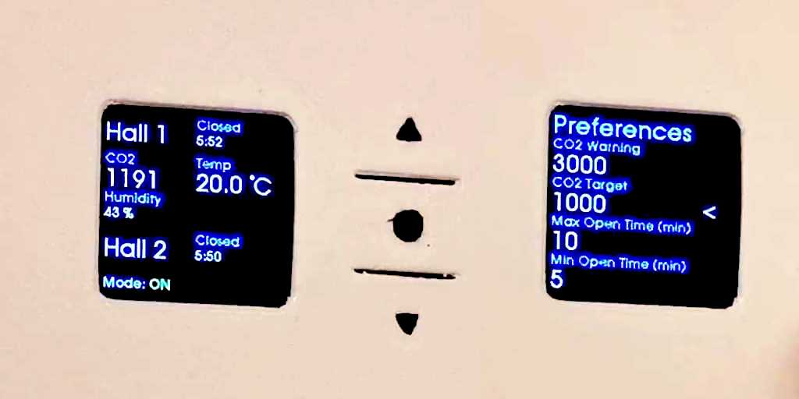
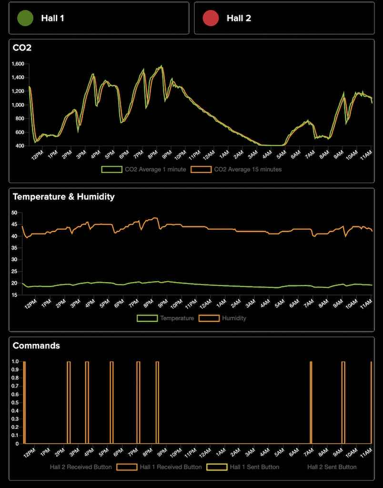
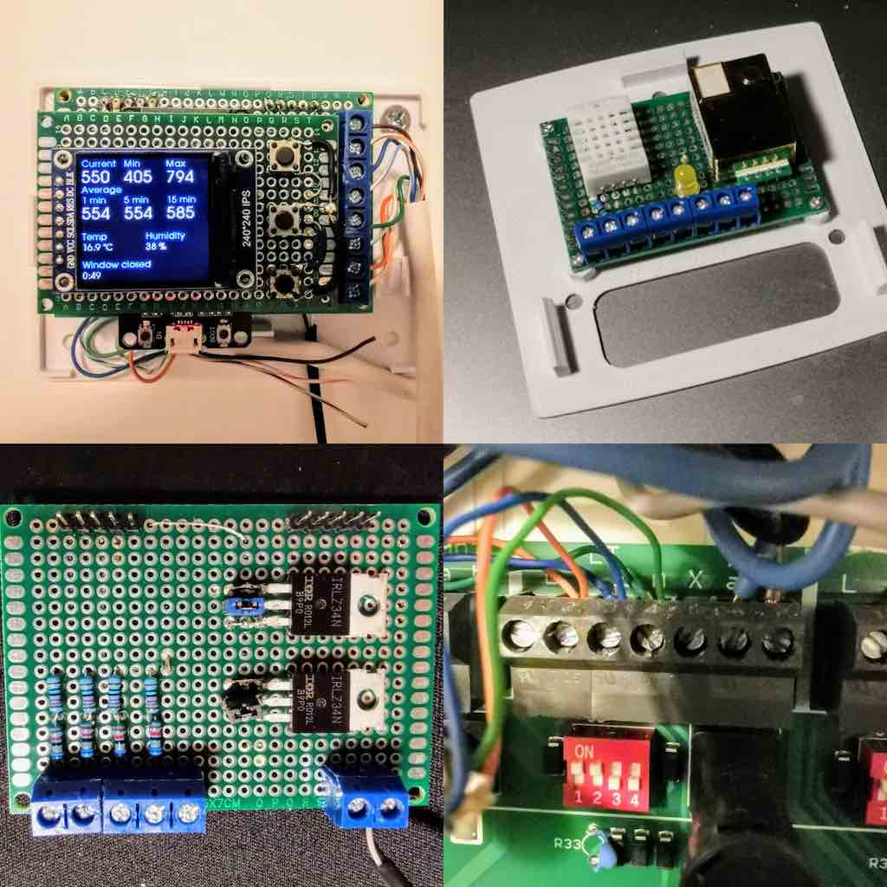
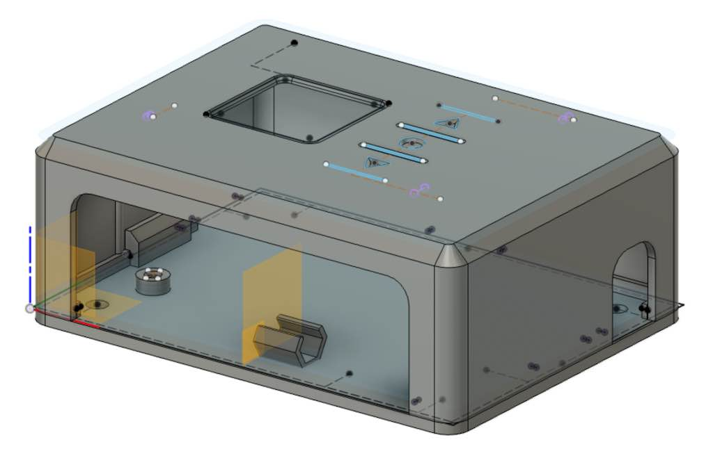

# Window Control

Control electric windows based on sensor data or time.

Hardware hooks in parallel to existing buttons used to control windows.

# Configuration

Preferences can be set from a menu. If device screen is off, press any keys to turn it on, then press any key again to open preferences. Navigate preferences with up and down buttons. Select for change with middle button. Change value with up and down. Confirm change with middle button. Save preferences by selecting Go Back which will bring you to the main screen.

WiFi and MQTT is configured using a computer or mobile device. If not connected before, an access point will be available. Connect to it and choose WiFi network the device should connect to.

Set MQTT details to have events logged. Tested with Adafruit IO.

# Hardware

ESP32.

240x240px IPS screen.

MH-Z19B CO2 reader.

DHT temperature and humidity sensor.

LED for signaling high CO2 level.

Simple voltage divider for reading 24v signal from existing system.

MOSFET for allowing 24v signal to pass trough, emulating button press.

# Software

Written in Arduino IDE 2.0.

Coded in C.

**Extra Fonts**

http://oleddisplay.squix.ch/

**Modifying font**

https://tchapi.github.io/Adafruit-GFX-Font-Customiser/

# Enclosures

Boxes for installing the components are modelled in Fusion 360.

https://a360.co/3J9pDIU

# Libraries

These libraries needs to be installed in Arduino IDE to be able to build.

**EspSoftwareSerial** by Dirk Kaar, Peter Lerup

https://github.com/plerup/espsoftwareserial/

**MH-Z19** by Jonathan Dempsey

https://github.com/WifWaf/MH-Z19/blob/master/examples/RetrieveDeviceInfo/RetrieveDeviceInfo.ino

**GFX Library for Arduino** by Moon On Our Nation

https://github.com/moononournation/Arduino_GFX/blob/master/examples/HelloWorld/HelloWorld.ino

**FTDebouncer** by Ubi de Feo

https://github.com/ubidefeo/FTDebouncer

**DHT sensor library** by Adafruit

https://github.com/adafruit/DHT-sensor-library

**WiFiManager** by tzapu

https://github.com/tzapu/WiFiManager

**PubSubClient** by Nick O'Leary

https://github.com/knolleary/pubsubclient
